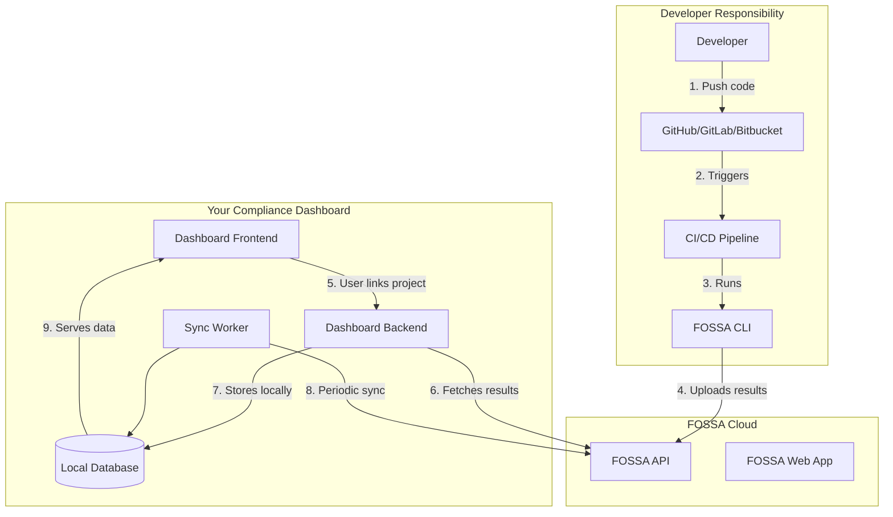
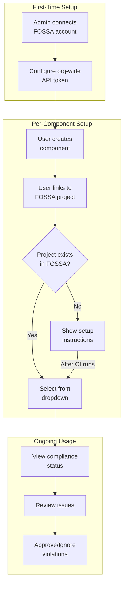
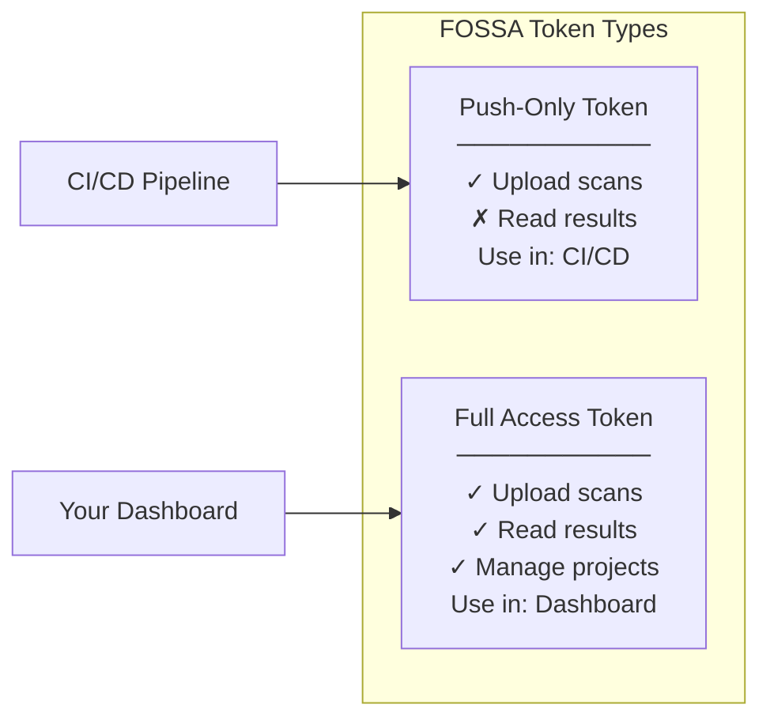
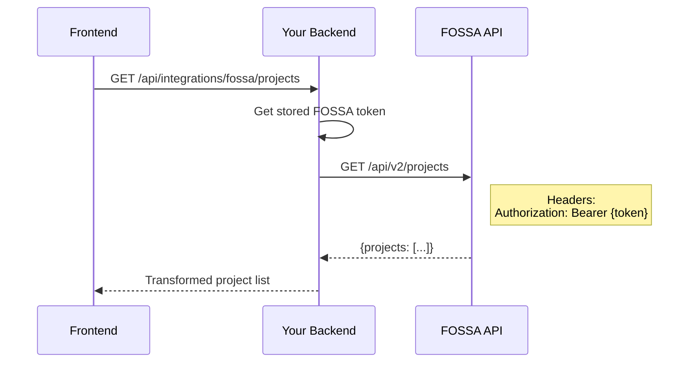
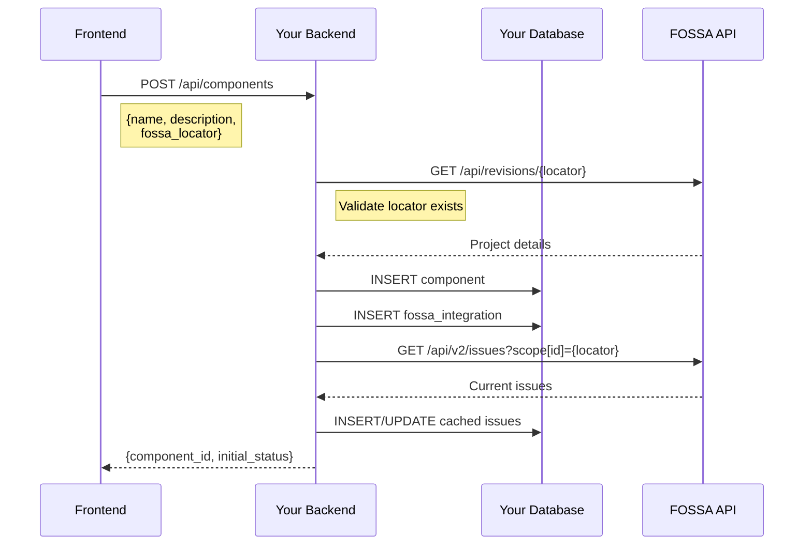
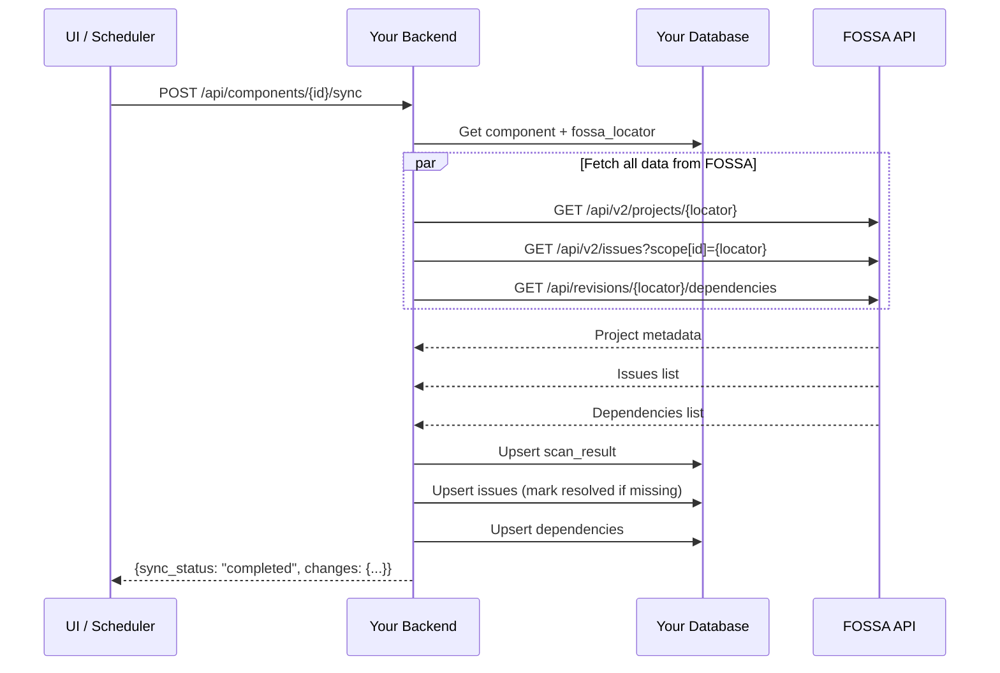
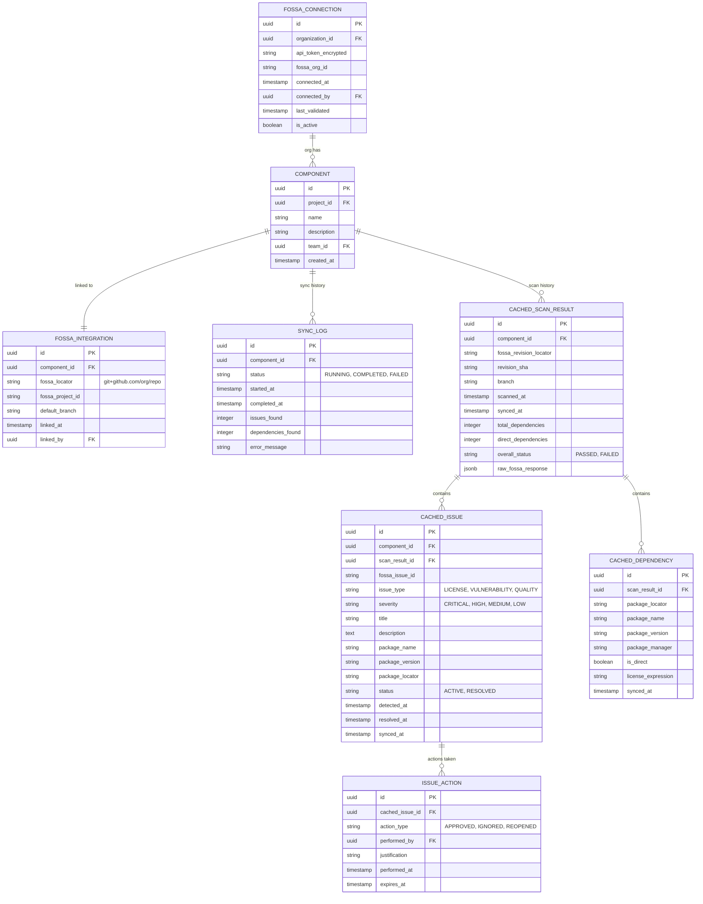
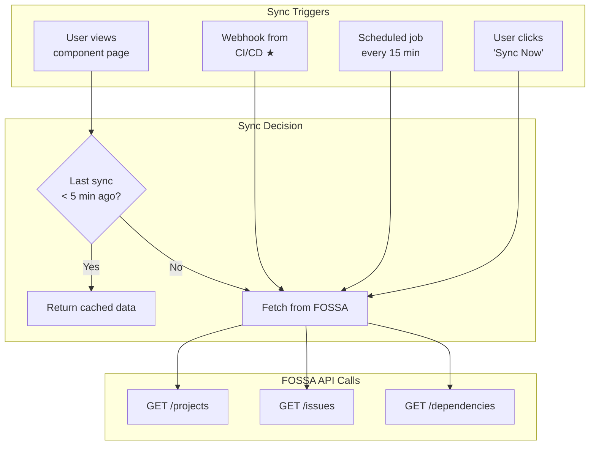
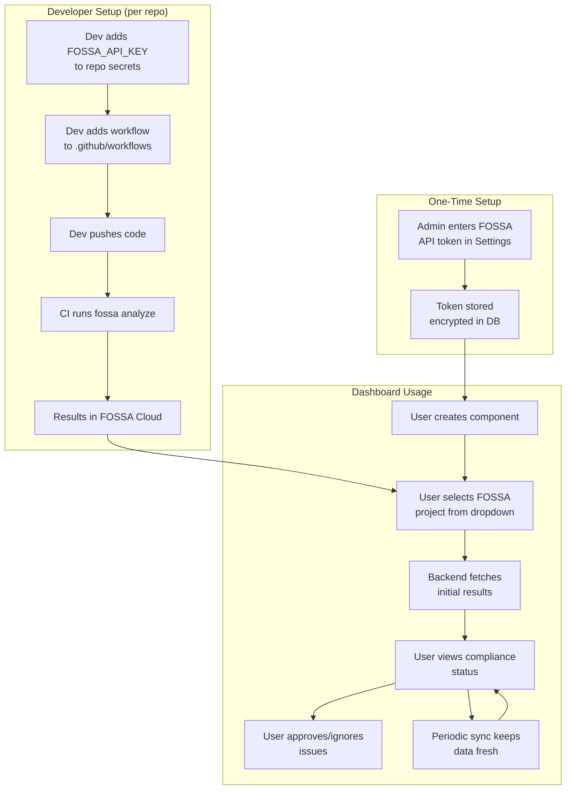

# Option B: CI/CD Integration Workflow

## Architecture Overview

Your compliance dashboard is a **results aggregator**, not the scan executor. Developers run FOSSA in their CI/CD pipelines, and your dashboard fetches, stores, and displays the results.



---

## What Your Dashboard Needs

### Core Features

| Feature | Purpose |
|---------|---------|
| **FOSSA Connection Setup** | Store organization's FOSSA API token |
| **Project Linker** | Link components to existing FOSSA projects |
| **Results Viewer** | Display compliance status, issues, dependencies |
| **Sync Mechanism** | Fetch latest results from FOSSA API |
| **Getting Started Guide** | Help users set up FOSSA in their pipelines |

---

## UI Flow: Complete User Journey



---

## Screen 1: FOSSA Connection Setup (Admin Only)

This is a **one-time setup** per organization.

```
┌─────────────────────────────────────────────────────────────────────────┐
│  ⚙️ Settings > Integrations > FOSSA                                     │
├─────────────────────────────────────────────────────────────────────────┤
│                                                                         │
│  ┌─────────────────────────────────────────────────────────────────┐   │
│  │  🔗 FOSSA Connection                                     ● Connected│
│  │                                                                     │
│  │  Organization:  Acme Corp                                          │
│  │  Connected by:  admin@acme.com                                     │
│  │  Connected on:  January 15, 2025                                   │
│  │                                                                     │
│  │  [Test Connection]  [Disconnect]                                   │
│  └─────────────────────────────────────────────────────────────────┘   │
│                                                                         │
│  ─ ─ ─ ─ ─ ─ ─ ─ ─ ─ ─ ─ ─ ─ ─ ─ ─ ─ ─ ─ ─ ─ ─ ─ ─ ─ ─ ─ ─ ─ ─ ─ ─   │
│                                                                         │
│  ⓘ This token is used to fetch scan results from FOSSA.               │
│    It requires read access to projects, issues, and dependencies.      │
│                                                                         │
│  📋 How to get your FOSSA API Token:                                   │
│                                                                         │
│  1. Log in to FOSSA at https://app.fossa.com                           │
│  2. Go to Settings → Integrations → API Tokens                         │
│  3. Click "Create Token"                                               │
│  4. Name it "Compliance Dashboard - Read Only"                         │
│  5. Select "Full Access" scope (required for reading all projects)     │
│  6. Copy the token and paste it below                                  │
│                                                                         │
│  FOSSA API Token:                                                       │
│  ┌─────────────────────────────────────────────────────────────────┐   │
│  │ ●●●●●●●●●●●●●●●●●●●●●●●●●●●●●●●●●●●●                    [Show] │   │
│  └─────────────────────────────────────────────────────────────────┘   │
│                                                                         │
│                                            [Cancel]  [Save Connection]  │
└─────────────────────────────────────────────────────────────────────────┘
```

### Token Types Explained



**Important:** Your dashboard needs a **Full Access token** to read project data. CI/CD pipelines can use **Push-Only tokens** for security.

---

## Screen 2: Create Component + Link to FOSSA

```
┌─────────────────────────────────────────────────────────────────────────┐
│  ➕ Add New Component                                                    │
├─────────────────────────────────────────────────────────────────────────┤
│                                                                         │
│  COMPONENT DETAILS                                                      │
│  ─────────────────────────────────────────────────────────────────────  │
│                                                                         │
│  Name *                                                                 │
│  ┌─────────────────────────────────────────────────────────────────┐   │
│  │ payment-service                                                  │   │
│  └─────────────────────────────────────────────────────────────────┘   │
│                                                                         │
│  Description                                                            │
│  ┌─────────────────────────────────────────────────────────────────┐   │
│  │ Handles payment processing and billing integration               │   │
│  └─────────────────────────────────────────────────────────────────┘   │
│                                                                         │
│  Team                                                                   │
│  ┌─────────────────────────────────────────────────────────────────┐   │
│  │ ▼ Payments Team                                                  │   │
│  └─────────────────────────────────────────────────────────────────┘   │
│                                                                         │
│                                                                         │
│  FOSSA PROJECT LINK                                                     │
│  ─────────────────────────────────────────────────────────────────────  │
│                                                                         │
│  Link to FOSSA Project *                                                │
│  ┌─────────────────────────────────────────────────────────────────┐   │
│  │ ▼ Select a FOSSA project...                                      │   │
│  ├─────────────────────────────────────────────────────────────────┤   │
│  │ 🔍 Search...                                                     │   │
│  ├─────────────────────────────────────────────────────────────────┤   │
│  │   git+github.com/acme/payment-service                           │   │
│  │   git+github.com/acme/payment-gateway                           │   │
│  │   git+github.com/acme/billing-api                               │   │
│  │ ─────────────────────────────────────────────────────────────── │   │
│  │   ⚠️ Don't see your project?                                    │   │
│  │   Your repo needs FOSSA configured in CI/CD first.              │   │
│  │   [View Setup Instructions]                                      │   │
│  └─────────────────────────────────────────────────────────────────┘   │
│                                                                         │
│  ⓘ Last scan: 2 hours ago • 147 dependencies • 3 issues               │
│                                                                         │
│                                                                         │
│                                             [Cancel]  [Create Component]│
└─────────────────────────────────────────────────────────────────────────┘
```

---

## Screen 3: Setup Instructions Modal

When user clicks "View Setup Instructions" or project doesn't exist:

```
┌─────────────────────────────────────────────────────────────────────────┐
│  🚀 Set Up FOSSA in Your CI/CD Pipeline                          [✕]   │
├─────────────────────────────────────────────────────────────────────────┤
│                                                                         │
│  Before linking a component, you need to configure FOSSA scanning      │
│  in your repository's CI/CD pipeline.                                   │
│                                                                         │
│  ━━━━━━━━━━━━━━━━━━━━━━━━━━━━━━━━━━━━━━━━━━━━━━━━━━━━━━━━━━━━━━━━━━━   │
│                                                                         │
│  STEP 1: Get Your FOSSA API Key                                         │
│  ───────────────────────────────────────────────────────────────────    │
│                                                                         │
│  1. Go to https://app.fossa.com/account/settings/integrations/api      │
│  2. Click "Add API Key"                                                 │
│  3. Name: "CI Pipeline - [repo-name]"                                   │
│  4. Token Type: "Push Only" (recommended for CI)                        │
│  5. Copy the generated token                                            │
│                                                                         │
│  ⚠️  Keep this token secret! Never commit it to your repository.       │
│                                                                         │
│                                                                         │
│  STEP 2: Add Token to Repository Secrets                                │
│  ───────────────────────────────────────────────────────────────────    │
│                                                                         │
│  ┌─────────────────────────────────────────────────────────────────┐   │
│  │ [GitHub]  [GitLab]  [Bitbucket]  [Azure DevOps]                 │   │
│  └─────────────────────────────────────────────────────────────────┘   │
│                                                                         │
│  GitHub:                                                                │
│  1. Go to Repository → Settings → Secrets → Actions                    │
│  2. Click "New repository secret"                                       │
│  3. Name: FOSSA_API_KEY                                                 │
│  4. Value: [paste your token]                                           │
│  5. Click "Add secret"                                                  │
│                                                                         │
│                                                                         │
│  STEP 3: Add FOSSA to Your Workflow                                     │
│  ───────────────────────────────────────────────────────────────────    │
│                                                                         │
│  Add this to your CI workflow file:                                     │
│                                                                         │
│  ┌─────────────────────────────────────────────────────────────────┐   │
│  │ # .github/workflows/fossa.yml                                   │   │
│  │                                                                  │   │
│  │ name: FOSSA License Scan                                        │   │
│  │                                                                  │   │
│  │ on:                                                              │   │
│  │   push:                                                          │   │
│  │     branches: [main, develop]                                    │   │
│  │   pull_request:                                                  │   │
│  │     branches: [main]                                             │   │
│  │                                                                  │   │
│  │ jobs:                                                            │   │
│  │   fossa-scan:                                                    │   │
│  │     runs-on: ubuntu-latest                                       │   │
│  │     steps:                                                       │   │
│  │       - uses: actions/checkout@v4                                │   │
│  │                                                                  │   │
│  │       - name: Install FOSSA CLI                                  │   │
│  │         run: |                                                   │   │
│  │           curl -H 'Cache-Control: no-cache' \                    │   │
│  │             https://raw.githubusercontent.com/fossas/\           │   │
│  │             fossa-cli/master/install-latest.sh | bash            │   │
│  │                                                                  │   │
│  │       - name: Run FOSSA Analyze                                  │   │
│  │         env:                                                     │   │
│  │           FOSSA_API_KEY: ${{ secrets.FOSSA_API_KEY }}            │   │
│  │         run: fossa analyze                                       │   │
│  │                                                                  │   │
│  │       - name: Run FOSSA Test                                     │   │
│  │         env:                                                     │   │
│  │           FOSSA_API_KEY: ${{ secrets.FOSSA_API_KEY }}            │   │
│  │         run: fossa test                                          │   │
│  └─────────────────────────────────────────────────────────────────┘   │
│                                                           [📋 Copy]    │
│                                                                         │
│                                                                         │
│  STEP 4: Trigger First Scan                                             │
│  ───────────────────────────────────────────────────────────────────    │
│                                                                         │
│  1. Commit the workflow file to your repository                         │
│  2. Push to main/develop branch                                         │
│  3. Wait for the CI pipeline to complete                                │
│  4. Return here and refresh the project list                            │
│                                                                         │
│  ━━━━━━━━━━━━━━━━━━━━━━━━━━━━━━━━━━━━━━━━━━━━━━━━━━━━━━━━━━━━━━━━━━━   │
│                                                                         │
│  ✅ After your first scan completes, your project will appear in the   │
│     dropdown above. This usually takes 2-5 minutes.                     │
│                                                                         │
│                          [View FOSSA Docs]  [Refresh Project List]      │
└─────────────────────────────────────────────────────────────────────────┘
```

---

## Screen 4: Component Detail / Compliance Status

After linking, user sees the compliance dashboard:

```
┌─────────────────────────────────────────────────────────────────────────┐
│  ← Back to Components                                                   │
│                                                                         │
│  payment-service                                            [⚙️ Settings]│
│  Handles payment processing and billing integration                     │
│  Team: Payments Team                                                    │
├─────────────────────────────────────────────────────────────────────────┤
│                                                                         │
│  ┌──────────────┐  ┌──────────────┐  ┌──────────────┐  ┌─────────────┐ │
│  │   ⚠️ ISSUES  │  │    📦 DEPS   │  │  🔄 SYNCED   │  │   FOSSA     │ │
│  │      3       │  │     147      │  │  5 min ago   │  │ [View ↗]    │ │
│  │  2 High      │  │  12 Direct   │  │              │  │             │ │
│  │  1 Medium    │  │  135 Trans.  │  │ [Sync Now]   │  │             │ │
│  └──────────────┘  └──────────────┘  └──────────────┘  └─────────────┘ │
│                                                                         │
│  ═══════════════════════════════════════════════════════════════════   │
│                                                                         │
│  COMPLIANCE ISSUES                                    [Export] [Filter] │
│  ───────────────────────────────────────────────────────────────────    │
│                                                                         │
│  ┌─────────────────────────────────────────────────────────────────┐   │
│  │ 🔴 HIGH   GPL-3.0 license in production dependency              │   │
│  │          Package: node-sass@4.14.1                              │   │
│  │          Policy: Production License Policy                       │   │
│  │          Detected: Jan 14, 2025                                 │   │
│  │                                          [Approve] [Ignore] [→] │   │
│  └─────────────────────────────────────────────────────────────────┘   │
│                                                                         │
│  ┌─────────────────────────────────────────────────────────────────┐   │
│  │ 🔴 HIGH   CVE-2024-1234 in lodash                               │   │
│  │          Package: lodash@4.17.20                                │   │
│  │          CVSS: 7.5 (High) • Fix available: 4.17.21              │   │
│  │          Detected: Jan 12, 2025                                 │   │
│  │                                          [Approve] [Ignore] [→] │   │
│  └─────────────────────────────────────────────────────────────────┘   │
│                                                                         │
│  ┌─────────────────────────────────────────────────────────────────┐   │
│  │ 🟡 MED    Outdated dependency                                   │   │
│  │          Package: axios@0.21.0 (latest: 1.6.0)                  │   │
│  │          2 years behind latest version                          │   │
│  │          Detected: Jan 14, 2025                                 │   │
│  │                                          [Approve] [Ignore] [→] │   │
│  └─────────────────────────────────────────────────────────────────┘   │
│                                                                         │
│  ═══════════════════════════════════════════════════════════════════   │
│                                                                         │
│  RECENT SCANS                                                           │
│  ───────────────────────────────────────────────────────────────────    │
│                                                                         │
│  │ Revision      │ Branch  │ Date           │ Issues │ Status    │     │
│  ├───────────────┼─────────┼────────────────┼────────┼───────────┤     │
│  │ abc123d       │ main    │ Jan 15, 10:30  │ 3      │ ⚠️ Failed │     │
│  │ def456e       │ main    │ Jan 14, 16:45  │ 3      │ ⚠️ Failed │     │
│  │ 789abc0       │ develop │ Jan 14, 14:20  │ 5      │ ⚠️ Failed │     │
│  │ 123def4       │ main    │ Jan 13, 09:00  │ 2      │ ✅ Passed │     │
│                                                                         │
└─────────────────────────────────────────────────────────────────────────┘
```

---

## Backend API Endpoints

### Endpoint 1: Fetch FOSSA Projects (for dropdown)



**Your Backend Endpoint:**
```
GET /api/integrations/fossa/projects
```

**Response:**
```json
{
  "projects": [
    {
      "locator": "git+github.com/acme/payment-service",
      "name": "payment-service",
      "last_scan": "2025-01-15T10:30:00Z",
      "default_branch": "main",
      "issue_count": 3
    },
    {
      "locator": "git+github.com/acme/user-service", 
      "name": "user-service",
      "last_scan": "2025-01-15T09:00:00Z",
      "default_branch": "main",
      "issue_count": 0
    }
  ]
}
```

---

### Endpoint 2: Create Component with FOSSA Link



**Your Backend Endpoint:**
```
POST /api/components
```

**Request:**
```json
{
  "name": "payment-service",
  "description": "Handles payment processing",
  "team_id": "team_123",
  "project_id": "proj_456",
  "fossa_locator": "git+github.com/acme/payment-service"
}
```

**Response:**
```json
{
  "id": "comp_789",
  "name": "payment-service",
  "fossa_locator": "git+github.com/acme/payment-service",
  "compliance_status": {
    "status": "FAILING",
    "issue_count": 3,
    "dependency_count": 147,
    "last_synced": "2025-01-15T10:35:00Z"
  }
}
```

---

### Endpoint 3: Sync Results from FOSSA



**Your Backend Endpoint:**
```
POST /api/components/{id}/sync
```

**Response:**
```json
{
  "sync_id": "sync_abc123",
  "status": "completed",
  "synced_at": "2025-01-15T10:35:00Z",
  "changes": {
    "new_issues": 1,
    "resolved_issues": 0,
    "dependencies_updated": 147
  },
  "compliance_status": {
    "status": "FAILING",
    "issues": {
      "critical": 0,
      "high": 2,
      "medium": 1,
      "low": 0
    }
  }
}
```

---

### Endpoint 4: Get Component Compliance Status

```
GET /api/components/{id}/compliance
```

**Response:**
```json
{
  "component_id": "comp_789",
  "component_name": "payment-service",
  "fossa_locator": "git+github.com/acme/payment-service",
  "last_synced": "2025-01-15T10:35:00Z",
  "fossa_last_scan": "2025-01-15T10:30:00Z",
  "overall_status": "FAILING",
  "summary": {
    "total_dependencies": 147,
    "direct_dependencies": 12,
    "transitive_dependencies": 135,
    "total_issues": 3,
    "issues_by_severity": {
      "critical": 0,
      "high": 2,
      "medium": 1,
      "low": 0
    },
    "issues_by_type": {
      "licensing": 1,
      "vulnerability": 1,
      "quality": 1
    }
  },
  "issues": [
    {
      "id": "issue_001",
      "external_id": "fossa_issue_abc",
      "type": "LICENSE",
      "severity": "HIGH",
      "title": "GPL-3.0 license in production dependency",
      "package_name": "node-sass",
      "package_version": "4.14.1",
      "policy_name": "Production License Policy",
      "detected_at": "2025-01-14T10:00:00Z",
      "status": "ACTIVE",
      "approval": null
    }
  ],
  "recent_scans": [
    {
      "revision": "abc123d",
      "branch": "main",
      "scanned_at": "2025-01-15T10:30:00Z",
      "issue_count": 3,
      "passed": false
    }
  ]
}
```

---

## Database Schema for Option B



---

## Sync Strategy: When to Fetch from FOSSA



### ★ Optional: Webhook from CI/CD

You can add a step to your CI workflow to notify your dashboard:

```yaml
# Add after fossa test
- name: Notify Compliance Dashboard
  if: always()
  run: |
    curl -X POST https://your-dashboard.com/api/webhooks/fossa-scan \
      -H "Authorization: Bearer ${{ secrets.DASHBOARD_TOKEN }}" \
      -H "Content-Type: application/json" \
      -d '{
        "repository": "${{ github.repository }}",
        "revision": "${{ github.sha }}",
        "branch": "${{ github.ref_name }}",
        "status": "${{ job.status }}"
      }'
```

---

## Complete Flow Summary



---

## Summary: What You Need to Build

| Component | Description | Priority |
|-----------|-------------|----------|
| **Settings Page** | Store/validate FOSSA API token | P0 |
| **Instructions Modal** | CI/CD setup guide for users | P0 |
| **Project Selector** | Fetch & display FOSSA projects | P0 |
| **Component CRUD** | Create component + link to FOSSA | P0 |
| **Sync Worker** | Fetch results from FOSSA API | P0 |
| **Compliance View** | Display issues, dependencies | P0 |
| **Issue Actions** | Approve/Ignore with audit trail | P1 |
| **CI Webhook** | Optional real-time sync trigger | P2 |
