# FOSSA Integration Workflow & Architecture

## System Overview

Your compliance dashboard integrates with FOSSA through a dedicated **Scanning Microservice** that orchestrates scan triggers, result collection, and policy evaluation storage.

---

## Scan Triggering Mechanisms

There are **three primary ways** to trigger FOSSA scans in your architecture:

```mermaid
flowchart LR
    subgraph "Trigger Sources"
        T1[🔄 CI/CD Pipeline<br/>On commit/PR]
        T2[📅 Scheduled Job<br/>Cron-based]
        T3[👆 Manual Request<br/>Dashboard UI]
    end
    
    subgraph "Scanning Service"
        Q[Scan Queue]
        W[Worker Pool]
    end
    
    subgraph "Execution"
        CLI[FOSSA CLI<br/>Container]
        API_CALL[FOSSA API<br/>Direct Call]
    end
    
    T1 --> Q
    T2 --> Q
    T3 --> Q
    
    Q --> W
    W --> CLI
    W --> API_CALL
```

### Trigger Type Comparison

| Trigger | Best For | Implementation |
|---------|----------|----------------|
| **CI/CD Webhook** | Real-time on every commit | GitHub Actions / GitLab CI calls your Scanning Service API |
| **Scheduled** | Nightly compliance reports | Kubernetes CronJob or internal scheduler |
| **On-Demand** | Release verification | Dashboard button → API → Scan Queue |

---

## Complete Scan Workflow Sequence

This diagram shows the full lifecycle from scan request to dashboard display:

---

## Detailed: How Analysis Happens

---

## Scan Worker Implementation Flow

---

## Entity-Relationship Diagram for Scanning Microservice

This schema supports **multiple scanner backends** (FOSSA now, Snyk later):

---

## Data Flow: From FOSSA to Dashboard

---

## API Contract: Scanning Service Endpoints

---

## Integration Timeline: When Things Happen

---

## Putting It Together: Complete Request Flow

---

## Summary: Key Integration Points

| Component | Responsibility | FOSSA Interaction |
|-----------|----------------|-------------------|
| **Scan Queue** | Job management | None (internal) |
| **Scan Worker** | Execution | CLI: `analyze`, `test`, `report` |
| **Results Collector** | Data fetching | API: `/issues`, `/dependencies` |
| **Policy Engine** | Rule comparison | API: Policy sync or internal DB |
| **Storage Layer** | Persistence | None (internal) |
| **Notification Service** | Real-time updates | Webhook receiver |

This architecture allows you to:
1. **Trigger scans** from CI/CD, schedules, or dashboard UI
2. **Isolate FOSSA logic** in a dedicated microservice
3. **Store results locally** for fast dashboard queries
4. **Add Snyk later** by implementing the same `ScannerProvider` interface
5. **Scale workers** independently based on scan volume