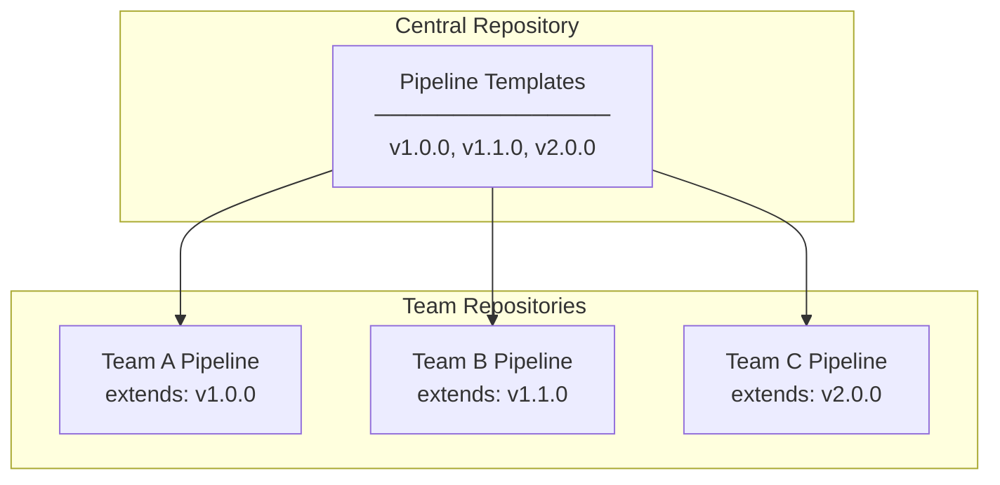
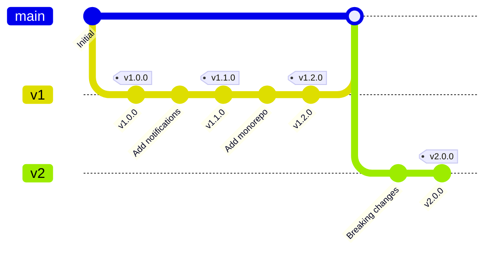

# Reusable FOSSA Scanning Pipeline Templates

## Overview

This document provides **versioned, reusable pipeline templates** that teams can extend in their own CI/CD configurations. The templates are maintained centrally and teams only need to include them with minimal configuration.



---

# Part 1: Azure DevOps Templates

## Repository Structure

Create a dedicated repository for your templates:

```
azure-pipeline-templates/
├── README.md
├── CHANGELOG.md
├── fossa/
│   ├── v1/
│   │   ├── scan.yml           # Main scanning template
│   │   ├── steps/
│   │   │   ├── install-cli.yml
│   │   │   ├── analyze.yml
│   │   │   ├── test.yml
│   │   │   └── notify-dashboard.yml
│   │   └── jobs/
│   │       └── fossa-scan-job.yml
│   └── v2/
│       ├── scan.yml
│       └── ...
└── shared/
    └── notify-webhook.yml
```

---

## Azure DevOps: Base Template (v1)

### `fossa/v1/scan.yml` - Main Template

```yaml
# ==============================================================================
# FOSSA Scanning Pipeline Template v1.0.0
# ==============================================================================
# Central template for FOSSA license and vulnerability scanning.
# Teams extend this template in their pipelines.
#
# Required Secrets (in consuming pipeline):
#   - FOSSA_API_KEY: Push-only or Full Access FOSSA token
#
# Optional Secrets:
#   - COMPLIANCE_DASHBOARD_TOKEN: For webhook notifications
#
# Usage:
#   See documentation at: https://your-docs/fossa-pipeline-setup
# ==============================================================================

parameters:
  # Required
  - name: fossaApiKeySecret
    type: string
    default: 'FOSSA_API_KEY'
    displayName: 'Name of the secret containing FOSSA API key'

  # Optional - Project Configuration
  - name: projectName
    type: string
    default: ''
    displayName: 'FOSSA project name (defaults to repo name)'
  
  - name: branch
    type: string
    default: '$(Build.SourceBranchName)'
    displayName: 'Branch name for FOSSA tracking'

  # Optional - Behavior
  - name: failOnIssues
    type: boolean
    default: true
    displayName: 'Fail pipeline if policy violations found'
  
  - name: analyzeOnlyDirectDeps
    type: boolean
    default: false
    displayName: 'Only analyze direct dependencies'
  
  - name: skipTest
    type: boolean
    default: false
    displayName: 'Skip fossa test (only run analyze)'

  # Optional - Notifications
  - name: notifyDashboard
    type: boolean
    default: true
    displayName: 'Notify compliance dashboard after scan'
  
  - name: dashboardWebhookUrl
    type: string
    default: 'https://compliance-dashboard.yourcompany.com/api/webhooks/fossa-scan'
    displayName: 'Compliance dashboard webhook URL'
  
  - name: dashboardTokenSecret
    type: string
    default: 'COMPLIANCE_DASHBOARD_TOKEN'
    displayName: 'Secret name for dashboard auth token'

  # Optional - Advanced
  - name: fossaCliVersion
    type: string
    default: 'latest'
    displayName: 'FOSSA CLI version to install'
  
  - name: workingDirectory
    type: string
    default: '$(Build.SourcesDirectory)'
    displayName: 'Directory to run FOSSA analysis'
  
  - name: additionalAnalyzeArgs
    type: string
    default: ''
    displayName: 'Additional arguments for fossa analyze'
  
  - name: additionalTestArgs
    type: string
    default: ''
    displayName: 'Additional arguments for fossa test'
  
  - name: timeout
    type: number
    default: 600
    displayName: 'Timeout for fossa test (seconds)'

stages:
  - stage: FOSSA_Scan
    displayName: 'FOSSA License & Security Scan'
    jobs:
      - job: FossaScan
        displayName: 'Run FOSSA Analysis'
        pool:
          vmImage: 'ubuntu-latest'
        
        variables:
          - name: FOSSA_PROJECT_NAME
            ${{ if eq(parameters.projectName, '') }}:
              value: '$(Build.Repository.Name)'
            ${{ else }}:
              value: '${{ parameters.projectName }}'
        
        steps:
          # Step 1: Install FOSSA CLI
          - task: Bash@3
            displayName: 'Install FOSSA CLI'
            inputs:
              targetType: 'inline'
              script: |
                echo "Installing FOSSA CLI version: ${{ parameters.fossaCliVersion }}"
                
                if [ "${{ parameters.fossaCliVersion }}" = "latest" ]; then
                  curl -H 'Cache-Control: no-cache' \
                    https://raw.githubusercontent.com/fossas/fossa-cli/master/install-latest.sh | bash
                else
                  curl -H 'Cache-Control: no-cache' \
                    https://raw.githubusercontent.com/fossas/fossa-cli/master/install-latest.sh | bash -s -- -b /usr/local/bin v${{ parameters.fossaCliVersion }}
                fi
                
                fossa --version
          
          # Step 2: Run FOSSA Analyze
          - task: Bash@3
            displayName: 'FOSSA Analyze'
            inputs:
              targetType: 'inline'
              workingDirectory: '${{ parameters.workingDirectory }}'
              script: |
                echo "Running FOSSA analyze..."
                echo "Project: $(FOSSA_PROJECT_NAME)"
                echo "Revision: $(Build.SourceVersion)"
                echo "Branch: ${{ parameters.branch }}"
                
                ANALYZE_ARGS="--project $(FOSSA_PROJECT_NAME)"
                ANALYZE_ARGS="$ANALYZE_ARGS --revision $(Build.SourceVersion)"
                ANALYZE_ARGS="$ANALYZE_ARGS --branch ${{ parameters.branch }}"
                
                ${{ if eq(parameters.analyzeOnlyDirectDeps, true) }}:
                  ANALYZE_ARGS="$ANALYZE_ARGS --only-direct"
                
                ${{ if ne(parameters.additionalAnalyzeArgs, '') }}:
                  ANALYZE_ARGS="$ANALYZE_ARGS ${{ parameters.additionalAnalyzeArgs }}"
                
                echo "Running: fossa analyze $ANALYZE_ARGS"
                fossa analyze $ANALYZE_ARGS
            env:
              FOSSA_API_KEY: $(${{ parameters.fossaApiKeySecret }})
          
          # Step 3: Run FOSSA Test (optional)
          - ${{ if eq(parameters.skipTest, false) }}:
            - task: Bash@3
              displayName: 'FOSSA Test (Policy Check)'
              inputs:
                targetType: 'inline'
                workingDirectory: '${{ parameters.workingDirectory }}'
                script: |
                  echo "Running FOSSA test..."
                  
                  TEST_ARGS="--timeout ${{ parameters.timeout }}"
                  
                  ${{ if ne(parameters.additionalTestArgs, '') }}:
                    TEST_ARGS="$TEST_ARGS ${{ parameters.additionalTestArgs }}"
                  
                  echo "Running: fossa test $TEST_ARGS"
                  
                  # Capture exit code
                  set +e
                  fossa test $TEST_ARGS
                  FOSSA_EXIT_CODE=$?
                  set -e
                  
                  echo "##vso[task.setvariable variable=fossaTestExitCode]$FOSSA_EXIT_CODE"
                  
                  if [ $FOSSA_EXIT_CODE -ne 0 ]; then
                    echo "##vso[task.logissue type=warning]FOSSA found policy violations"
                    
                    ${{ if eq(parameters.failOnIssues, true) }}:
                      echo "##vso[task.complete result=Failed;]Policy violations found"
                      exit 1
                    else:
                      echo "##vso[task.logissue type=warning]Continuing despite policy violations (failOnIssues=false)"
                  fi
              env:
                FOSSA_API_KEY: $(${{ parameters.fossaApiKeySecret }})
          
          # Step 4: Notify Compliance Dashboard (optional)
          - ${{ if eq(parameters.notifyDashboard, true) }}:
            - task: Bash@3
              displayName: 'Notify Compliance Dashboard'
              condition: always()
              inputs:
                targetType: 'inline'
                script: |
                  echo "Notifying compliance dashboard..."
                  
                  # Determine status
                  if [ "$(fossaTestExitCode)" = "0" ] || [ "${{ parameters.skipTest }}" = "true" ]; then
                    SCAN_STATUS="passed"
                  else
                    SCAN_STATUS="failed"
                  fi
                  
                  curl -X POST "${{ parameters.dashboardWebhookUrl }}" \
                    -H "Authorization: Bearer $DASHBOARD_TOKEN" \
                    -H "Content-Type: application/json" \
                    -d "{
                      \"event\": \"fossa.scan.completed\",
                      \"repository\": \"$(Build.Repository.Name)\",
                      \"repositoryUrl\": \"$(Build.Repository.Uri)\",
                      \"revision\": \"$(Build.SourceVersion)\",
                      \"branch\": \"${{ parameters.branch }}\",
                      \"status\": \"$SCAN_STATUS\",
                      \"buildId\": \"$(Build.BuildId)\",
                      \"buildUrl\": \"$(System.CollectionUri)$(System.TeamProject)/_build/results?buildId=$(Build.BuildId)\",
                      \"timestamp\": \"$(date -u +%Y-%m-%dT%H:%M:%SZ)\"
                    }" || echo "Warning: Failed to notify dashboard"
              env:
                DASHBOARD_TOKEN: $(${{ parameters.dashboardTokenSecret }})
```

---

## Azure DevOps: How Teams Extend the Template

### Step 1: Add Template Repository as a Resource

In the team's `azure-pipelines.yml`:

```yaml
# ==============================================================================
# Team: Payments Service
# Pipeline: CI with FOSSA Scanning
# ==============================================================================

trigger:
  branches:
    include:
      - main
      - develop
      - release/*

pr:
  branches:
    include:
      - main

# Reference the central templates repository
resources:
  repositories:
    - repository: templates
      type: git
      name: DevOps/azure-pipeline-templates  # Your templates repo
      ref: refs/tags/v1.0.0                   # Pin to specific version!

stages:
  # Your existing build stages
  - stage: Build
    jobs:
      - job: BuildApp
        steps:
          - script: npm install
          - script: npm run build
          - script: npm test

  # Include FOSSA scanning from template
  - template: fossa/v1/scan.yml@templates
    parameters:
      fossaApiKeySecret: 'FOSSA_API_KEY'
      projectName: 'payment-service'
      failOnIssues: true
      notifyDashboard: true
```

### Step 2: Configure Secrets

In Azure DevOps:
1. Go to **Pipelines** → **Library** → **Variable Groups**
2. Create a variable group (e.g., `fossa-credentials`)
3. Add variables:
   - `FOSSA_API_KEY` (mark as secret)
   - `COMPLIANCE_DASHBOARD_TOKEN` (mark as secret)
4. Link the variable group to your pipeline

---

## Azure DevOps: Extension Examples

### Example 1: Minimal Configuration

```yaml
resources:
  repositories:
    - repository: templates
      type: git
      name: DevOps/azure-pipeline-templates
      ref: refs/tags/v1.0.0

stages:
  - template: fossa/v1/scan.yml@templates
```
*Uses all defaults. Requires `FOSSA_API_KEY` secret in pipeline.*

---

### Example 2: Custom Project Name + No Failure on Issues

```yaml
resources:
  repositories:
    - repository: templates
      type: git
      name: DevOps/azure-pipeline-templates
      ref: refs/tags/v1.0.0

stages:
  - template: fossa/v1/scan.yml@templates
    parameters:
      projectName: 'my-custom-project-name'
      failOnIssues: false        # Don't fail pipeline on violations
      notifyDashboard: true       # But still notify dashboard
```

---

### Example 3: Monorepo - Scan Specific Directory

```yaml
resources:
  repositories:
    - repository: templates
      type: git
      name: DevOps/azure-pipeline-templates
      ref: refs/tags/v1.0.0

stages:
  # Scan backend
  - template: fossa/v1/scan.yml@templates
    parameters:
      projectName: 'myapp-backend'
      workingDirectory: '$(Build.SourcesDirectory)/backend'
  
  # Scan frontend
  - template: fossa/v1/scan.yml@templates
    parameters:
      projectName: 'myapp-frontend'
      workingDirectory: '$(Build.SourcesDirectory)/frontend'
```

---

### Example 4: Only Analyze (Skip Policy Test)

```yaml
resources:
  repositories:
    - repository: templates
      type: git
      name: DevOps/azure-pipeline-templates
      ref: refs/tags/v1.0.0

stages:
  - template: fossa/v1/scan.yml@templates
    parameters:
      skipTest: true    # Only run analyze, don't check policies
```

---

### Example 5: With Additional FOSSA Arguments

```yaml
resources:
  repositories:
    - repository: templates
      type: git
      name: DevOps/azure-pipeline-templates
      ref: refs/tags/v1.0.0

stages:
  - template: fossa/v1/scan.yml@templates
    parameters:
      additionalAnalyzeArgs: '--detect-vendored --debug'
      additionalTestArgs: '--suppress-issues "MIT,Apache-2.0"'
      timeout: 900
```

---

# Part 2: GitLab CI Templates

## Repository Structure

Create a dedicated project for templates:

```
gitlab-ci-templates/
├── README.md
├── CHANGELOG.md
├── fossa/
│   ├── v1/
│   │   ├── .fossa-scan.yml           # Main template
│   │   └── .fossa-scan-minimal.yml   # Lightweight version
│   └── v2/
│       └── .fossa-scan.yml
└── shared/
    └── .notify-webhook.yml
```

---

## GitLab: Base Template (v1)

### `fossa/v1/.fossa-scan.yml` - Main Template

```yaml
# ==============================================================================
# FOSSA Scanning Pipeline Template v1.0.0
# ==============================================================================
# Central template for FOSSA license and vulnerability scanning.
# Teams include this template in their .gitlab-ci.yml
#
# Required CI/CD Variables:
#   - FOSSA_API_KEY: Push-only or Full Access FOSSA token
#
# Optional CI/CD Variables:
#   - COMPLIANCE_DASHBOARD_TOKEN: For webhook notifications
#   - FOSSA_PROJECT_NAME: Override project name (defaults to $CI_PROJECT_NAME)
#
# Usage:
#   include:
#     - project: 'devops/gitlab-ci-templates'
#       ref: 'v1.0.0'
#       file: '/fossa/v1/.fossa-scan.yml'
#
# Documentation: https://your-docs/fossa-pipeline-setup
# ==============================================================================

# Configurable variables with defaults
variables:
  # FOSSA Configuration
  FOSSA_CLI_VERSION: "latest"
  FOSSA_PROJECT_NAME: "${CI_PROJECT_NAME}"
  FOSSA_BRANCH: "${CI_COMMIT_REF_NAME}"
  FOSSA_REVISION: "${CI_COMMIT_SHA}"
  
  # Behavior
  FOSSA_FAIL_ON_ISSUES: "true"
  FOSSA_SKIP_TEST: "false"
  FOSSA_ANALYZE_ONLY_DIRECT: "false"
  FOSSA_TEST_TIMEOUT: "600"
  
  # Additional arguments (empty by default)
  FOSSA_ADDITIONAL_ANALYZE_ARGS: ""
  FOSSA_ADDITIONAL_TEST_ARGS: ""
  
  # Dashboard Notification
  FOSSA_NOTIFY_DASHBOARD: "true"
  COMPLIANCE_DASHBOARD_URL: "https://compliance-dashboard.yourcompany.com/api/webhooks/fossa-scan"
  
  # Working directory (for monorepos)
  FOSSA_WORKING_DIRECTORY: "${CI_PROJECT_DIR}"

# Define the FOSSA scanning stage
stages:
  - fossa-scan

# Hidden job template (for extension)
.fossa-base:
  image: ubuntu:22.04
  before_script:
    - apt-get update && apt-get install -y curl jq
    # Install FOSSA CLI
    - |
      echo "Installing FOSSA CLI version: ${FOSSA_CLI_VERSION}"
      if [ "${FOSSA_CLI_VERSION}" = "latest" ]; then
        curl -H 'Cache-Control: no-cache' \
          https://raw.githubusercontent.com/fossas/fossa-cli/master/install-latest.sh | bash
      else
        curl -H 'Cache-Control: no-cache' \
          https://raw.githubusercontent.com/fossas/fossa-cli/master/install-latest.sh | bash -s -- -b /usr/local/bin v${FOSSA_CLI_VERSION}
      fi
    - fossa --version

# Main FOSSA scanning job
fossa-scan:
  extends: .fossa-base
  stage: fossa-scan
  script:
    # Build analyze arguments
    - |
      ANALYZE_ARGS="--project ${FOSSA_PROJECT_NAME}"
      ANALYZE_ARGS="${ANALYZE_ARGS} --revision ${FOSSA_REVISION}"
      ANALYZE_ARGS="${ANALYZE_ARGS} --branch ${FOSSA_BRANCH}"
      
      if [ "${FOSSA_ANALYZE_ONLY_DIRECT}" = "true" ]; then
        ANALYZE_ARGS="${ANALYZE_ARGS} --only-direct"
      fi
      
      if [ -n "${FOSSA_ADDITIONAL_ANALYZE_ARGS}" ]; then
        ANALYZE_ARGS="${ANALYZE_ARGS} ${FOSSA_ADDITIONAL_ANALYZE_ARGS}"
      fi
      
      echo "Running: fossa analyze ${ANALYZE_ARGS}"
      cd "${FOSSA_WORKING_DIRECTORY}"
      fossa analyze ${ANALYZE_ARGS}
    
    # Run FOSSA test (unless skipped)
    - |
      if [ "${FOSSA_SKIP_TEST}" = "true" ]; then
        echo "Skipping fossa test (FOSSA_SKIP_TEST=true)"
        FOSSA_TEST_EXIT_CODE=0
      else
        TEST_ARGS="--timeout ${FOSSA_TEST_TIMEOUT}"
        
        if [ -n "${FOSSA_ADDITIONAL_TEST_ARGS}" ]; then
          TEST_ARGS="${TEST_ARGS} ${FOSSA_ADDITIONAL_TEST_ARGS}"
        fi
        
        echo "Running: fossa test ${TEST_ARGS}"
        
        set +e
        fossa test ${TEST_ARGS}
        FOSSA_TEST_EXIT_CODE=$?
        set -e
        
        echo "FOSSA test exit code: ${FOSSA_TEST_EXIT_CODE}"
      fi
      
      # Export for after_script
      echo "FOSSA_TEST_EXIT_CODE=${FOSSA_TEST_EXIT_CODE}" >> fossa_result.env
    
    # Handle test result
    - |
      if [ "${FOSSA_TEST_EXIT_CODE}" -ne 0 ]; then
        echo "⚠️  FOSSA found policy violations!"
        
        if [ "${FOSSA_FAIL_ON_ISSUES}" = "true" ]; then
          echo "❌ Failing pipeline (FOSSA_FAIL_ON_ISSUES=true)"
          exit 1
        else
          echo "⚠️  Continuing despite violations (FOSSA_FAIL_ON_ISSUES=false)"
        fi
      else
        echo "✅ FOSSA scan passed - no policy violations"
      fi
  
  after_script:
    # Notify compliance dashboard
    - |
      if [ "${FOSSA_NOTIFY_DASHBOARD}" = "true" ]; then
        echo "Notifying compliance dashboard..."
        
        # Determine status
        if [ -f fossa_result.env ]; then
          source fossa_result.env
        else
          FOSSA_TEST_EXIT_CODE=0
        fi
        
        if [ "${FOSSA_TEST_EXIT_CODE:-0}" = "0" ]; then
          SCAN_STATUS="passed"
        else
          SCAN_STATUS="failed"
        fi
        
        curl -X POST "${COMPLIANCE_DASHBOARD_URL}" \
          -H "Authorization: Bearer ${COMPLIANCE_DASHBOARD_TOKEN}" \
          -H "Content-Type: application/json" \
          -d "{
            \"event\": \"fossa.scan.completed\",
            \"repository\": \"${CI_PROJECT_PATH}\",
            \"repositoryUrl\": \"${CI_PROJECT_URL}\",
            \"revision\": \"${FOSSA_REVISION}\",
            \"branch\": \"${FOSSA_BRANCH}\",
            \"status\": \"${SCAN_STATUS}\",
            \"pipelineId\": \"${CI_PIPELINE_ID}\",
            \"pipelineUrl\": \"${CI_PIPELINE_URL}\",
            \"jobId\": \"${CI_JOB_ID}\",
            \"timestamp\": \"$(date -u +%Y-%m-%dT%H:%M:%SZ)\"
          }" || echo "Warning: Failed to notify dashboard"
      fi
  
  # Artifacts for debugging
  artifacts:
    when: always
    paths:
      - fossa_result.env
    expire_in: 1 week
  
  # Default rules - can be overridden
  rules:
    - if: $CI_COMMIT_BRANCH == $CI_DEFAULT_BRANCH
    - if: $CI_PIPELINE_SOURCE == "merge_request_event"
    - if: $CI_COMMIT_TAG
```

---

## GitLab: How Teams Extend the Template

### Step 1: Include the Template

In the team's `.gitlab-ci.yml`:

```yaml
# ==============================================================================
# Team: Payments Service
# Pipeline: CI with FOSSA Scanning
# ==============================================================================

# Include the central FOSSA template
include:
  - project: 'devops/gitlab-ci-templates'
    ref: 'v1.0.0'                           # Pin to specific version!
    file: '/fossa/v1/.fossa-scan.yml'

# Define your stages (fossa-scan is already defined in template)
stages:
  - build
  - test
  - fossa-scan    # From template
  - deploy

# Your existing jobs
build:
  stage: build
  script:
    - npm install
    - npm run build

test:
  stage: test
  script:
    - npm test

# FOSSA job is automatically included from template
# No additional configuration needed if defaults are OK

deploy:
  stage: deploy
  script:
    - ./deploy.sh
  only:
    - main
```

### Step 2: Configure CI/CD Variables

In GitLab:
1. Go to **Settings** → **CI/CD** → **Variables**
2. Add variables:
   - `FOSSA_API_KEY` (masked, protected)
   - `COMPLIANCE_DASHBOARD_TOKEN` (masked, protected)

---

## GitLab: Extension Examples

### Example 1: Minimal Configuration

```yaml
include:
  - project: 'devops/gitlab-ci-templates'
    ref: 'v1.0.0'
    file: '/fossa/v1/.fossa-scan.yml'

stages:
  - fossa-scan

# That's it! Uses all defaults.
```

---

### Example 2: Custom Variables

```yaml
include:
  - project: 'devops/gitlab-ci-templates'
    ref: 'v1.0.0'
    file: '/fossa/v1/.fossa-scan.yml'

variables:
  FOSSA_PROJECT_NAME: "custom-project-name"
  FOSSA_FAIL_ON_ISSUES: "false"    # Don't fail on violations
  FOSSA_NOTIFY_DASHBOARD: "true"

stages:
  - build
  - fossa-scan
```

---

### Example 3: Override the Job Completely

```yaml
include:
  - project: 'devops/gitlab-ci-templates'
    ref: 'v1.0.0'
    file: '/fossa/v1/.fossa-scan.yml'

stages:
  - build
  - fossa-scan

# Override the fossa-scan job
fossa-scan:
  extends: .fossa-base    # Still use the base setup
  stage: fossa-scan
  variables:
    FOSSA_PROJECT_NAME: "my-overridden-project"
  script:
    - fossa analyze --project ${FOSSA_PROJECT_NAME}
    # Custom logic here
    - echo "Custom post-analysis step"
  rules:
    - if: $CI_COMMIT_BRANCH == "main"    # Only scan main branch
```

---

### Example 4: Monorepo - Multiple Scans

```yaml
include:
  - project: 'devops/gitlab-ci-templates'
    ref: 'v1.0.0'
    file: '/fossa/v1/.fossa-scan.yml'

stages:
  - build
  - fossa-scan

# Scan backend
fossa-scan-backend:
  extends: .fossa-base
  stage: fossa-scan
  variables:
    FOSSA_PROJECT_NAME: "${CI_PROJECT_NAME}-backend"
    FOSSA_WORKING_DIRECTORY: "${CI_PROJECT_DIR}/backend"
  script:
    - cd ${FOSSA_WORKING_DIRECTORY}
    - fossa analyze --project ${FOSSA_PROJECT_NAME} --revision ${CI_COMMIT_SHA}
    - fossa test

# Scan frontend
fossa-scan-frontend:
  extends: .fossa-base
  stage: fossa-scan
  variables:
    FOSSA_PROJECT_NAME: "${CI_PROJECT_NAME}-frontend"
    FOSSA_WORKING_DIRECTORY: "${CI_PROJECT_DIR}/frontend"
  script:
    - cd ${FOSSA_WORKING_DIRECTORY}
    - fossa analyze --project ${FOSSA_PROJECT_NAME} --revision ${CI_COMMIT_SHA}
    - fossa test
```

---

### Example 5: Custom Rules (Trigger Conditions)

```yaml
include:
  - project: 'devops/gitlab-ci-templates'
    ref: 'v1.0.0'
    file: '/fossa/v1/.fossa-scan.yml'

stages:
  - fossa-scan

# Override rules for when to run
fossa-scan:
  rules:
    - if: $CI_COMMIT_BRANCH == "main"
      when: always
    - if: $CI_COMMIT_BRANCH == "develop"
      when: always
    - if: $CI_PIPELINE_SOURCE == "merge_request_event"
      when: always
    - if: $CI_COMMIT_TAG
      when: always
    - when: never    # Don't run on feature branches
```

---

### Example 6: Allow Failures (Non-Blocking Scan)

```yaml
include:
  - project: 'devops/gitlab-ci-templates'
    ref: 'v1.0.0'
    file: '/fossa/v1/.fossa-scan.yml'

stages:
  - build
  - fossa-scan
  - deploy

# Make FOSSA scan non-blocking
fossa-scan:
  allow_failure: true    # Pipeline continues even if FOSSA fails
  variables:
    FOSSA_FAIL_ON_ISSUES: "true"    # Still report issues

deploy:
  stage: deploy
  needs: ["build"]    # Deploy doesn't need to wait for fossa-scan
  script:
    - ./deploy.sh
```

---

# Part 3: Version Management

## Semantic Versioning Strategy

```
v1.0.0 - Initial release
v1.1.0 - Added dashboard notification
v1.2.0 - Added monorepo support
v2.0.0 - Breaking change: renamed parameters
```



## Upgrade Guide for Teams

### Checking Current Version

**Azure DevOps:**
```yaml
resources:
  repositories:
    - repository: templates
      ref: refs/tags/v1.0.0    # ← Current version
```

**GitLab:**
```yaml
include:
  - project: 'devops/gitlab-ci-templates'
    ref: 'v1.0.0'              # ← Current version
```

### Upgrade Process

1. **Read CHANGELOG** for the new version
2. **Test in non-production** branch first
3. **Update the ref** in your pipeline
4. **Verify** the pipeline runs successfully

---

# Part 4: Quick Reference Card

## Azure DevOps

```yaml
# Minimal
resources:
  repositories:
    - repository: templates
      type: git
      name: DevOps/azure-pipeline-templates
      ref: refs/tags/v1.0.0

stages:
  - template: fossa/v1/scan.yml@templates
```

```yaml
# Full customization
stages:
  - template: fossa/v1/scan.yml@templates
    parameters:
      fossaApiKeySecret: 'FOSSA_API_KEY'
      projectName: 'my-project'
      failOnIssues: false
      skipTest: false
      notifyDashboard: true
      workingDirectory: '$(Build.SourcesDirectory)/backend'
      additionalAnalyzeArgs: '--detect-vendored'
      timeout: 900
```

## GitLab CI

```yaml
# Minimal
include:
  - project: 'devops/gitlab-ci-templates'
    ref: 'v1.0.0'
    file: '/fossa/v1/.fossa-scan.yml'

stages:
  - fossa-scan
```

```yaml
# Full customization
include:
  - project: 'devops/gitlab-ci-templates'
    ref: 'v1.0.0'
    file: '/fossa/v1/.fossa-scan.yml'

variables:
  FOSSA_PROJECT_NAME: "my-project"
  FOSSA_FAIL_ON_ISSUES: "false"
  FOSSA_SKIP_TEST: "false"
  FOSSA_NOTIFY_DASHBOARD: "true"
  FOSSA_WORKING_DIRECTORY: "${CI_PROJECT_DIR}/backend"
  FOSSA_ADDITIONAL_ANALYZE_ARGS: "--detect-vendored"
  FOSSA_TEST_TIMEOUT: "900"

stages:
  - fossa-scan
```

---

# Part 5: Troubleshooting

| Problem | Solution |
|---------|----------|
| "Template not found" | Check repository name and ref (tag) are correct |
| "FOSSA_API_KEY not set" | Add secret to pipeline variables/library |
| "fossa analyze failed" | Check working directory contains valid project files |
| "fossa test timeout" | Increase `timeout` parameter |
| "Dashboard notification failed" | Verify webhook URL and token |
| "Permission denied" | Ensure templates repo is accessible to your project |

---

# Summary

| Platform | Include Syntax | Pin Version | Key Variables |
|----------|---------------|-------------|---------------|
| **Azure DevOps** | `template: fossa/v1/scan.yml@templates` | `ref: refs/tags/v1.0.0` | Parameters in `parameters:` block |
| **GitLab CI** | `include: - project: '...'` | `ref: 'v1.0.0'` | `variables:` block or job override |

**Golden Rules:**
1. ✅ Always pin to a specific version tag
2. ✅ Store secrets in CI/CD variables, never in code
3. ✅ Test template upgrades in non-production first
4. ✅ Use `FOSSA_FAIL_ON_ISSUES: false` during initial rollout
