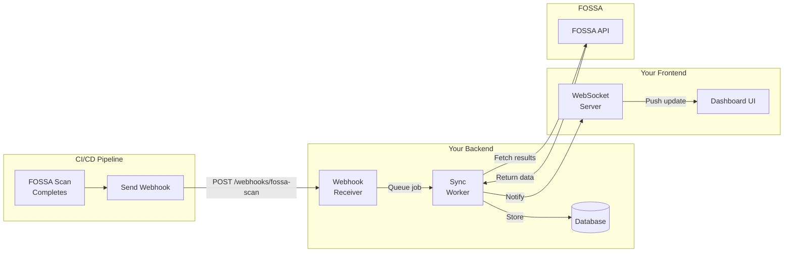
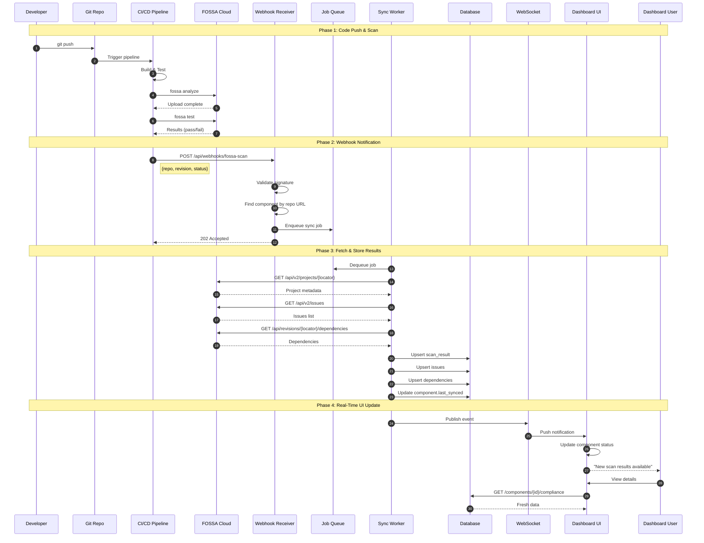
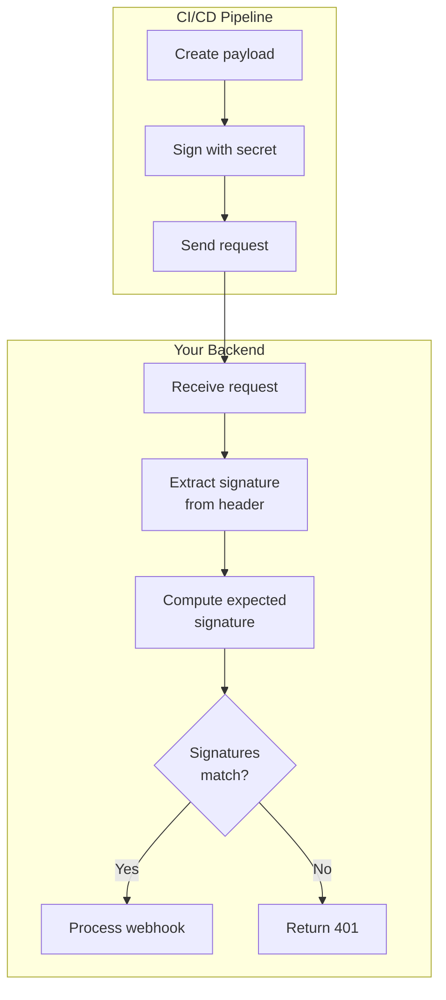
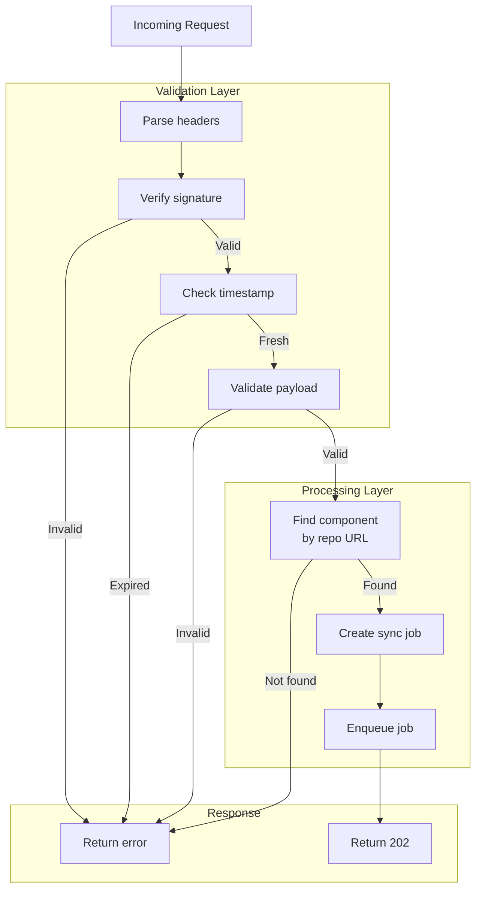
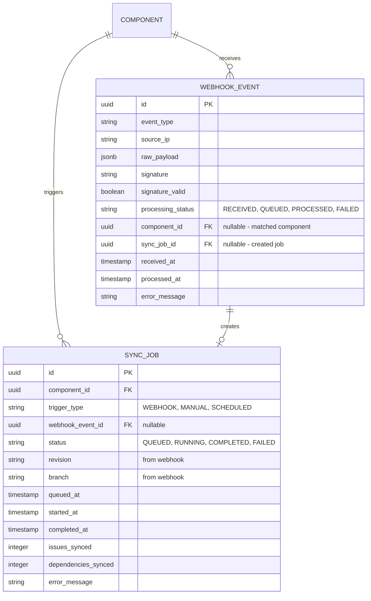
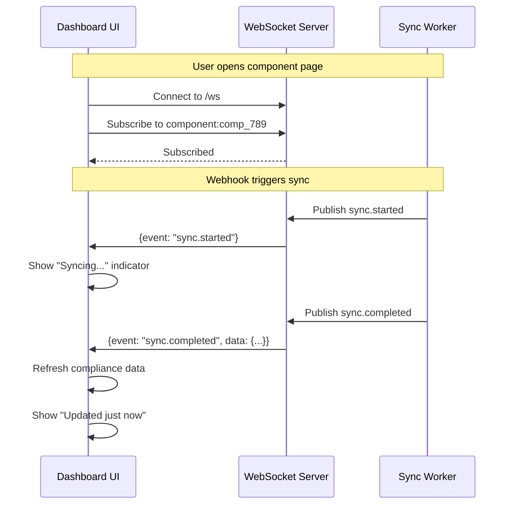
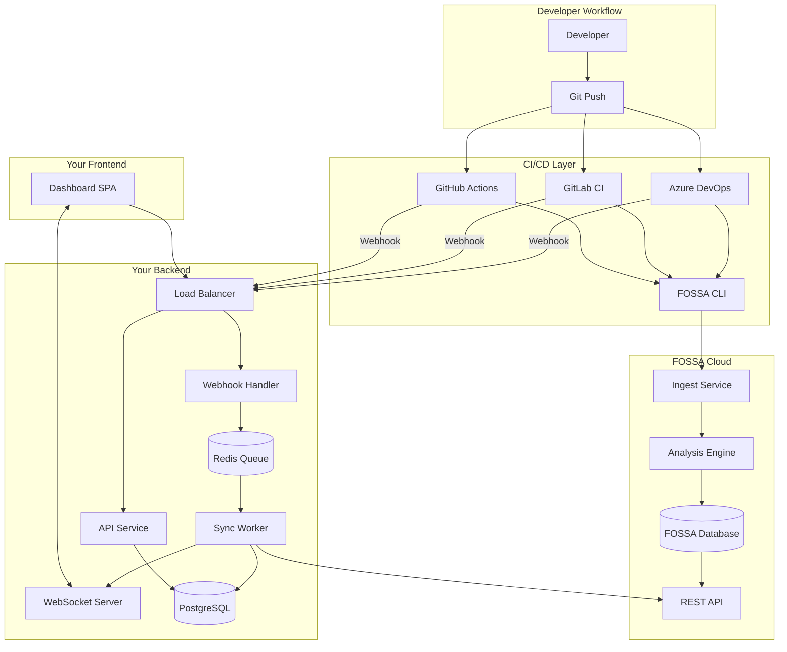
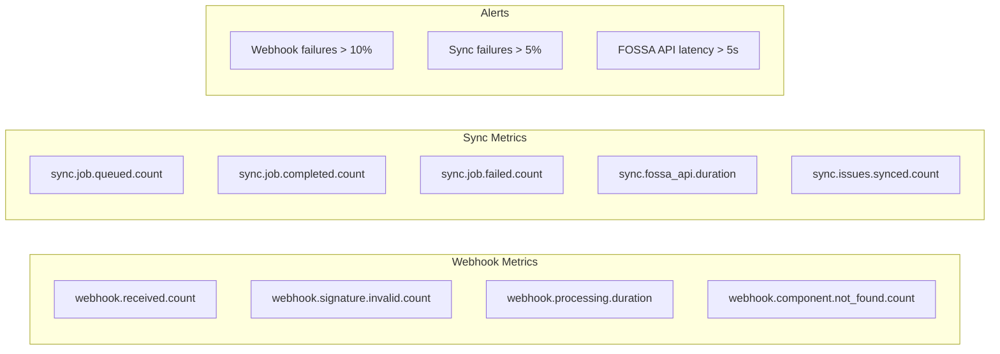

# Webhook-Driven Compliance Dashboard Workflow

## Overview

Webhooks enable **real-time synchronization** between CI/CD pipelines and your compliance dashboard. When a FOSSA scan completes, the pipeline sends a webhook to your backend, triggering an immediate sync of results.



---

## Why Webhooks?

| Approach | Latency | Resource Usage | Complexity |
|----------|---------|----------------|------------|
| **Polling every 5 min** | Up to 5 min delay | Constant API calls | Low |
| **Polling every 1 min** | Up to 1 min delay | Heavy API load | Low |
| **Webhook-triggered** | ~5 seconds | Only when needed | Medium |

**Webhook advantages:**
- Users see results immediately after CI completes
- No wasted API calls polling for unchanged data
- Scales better with many components

---

## Complete Workflow Sequence



---

## Webhook API Specification

### Endpoint Definition

```
POST /api/webhooks/fossa-scan
Content-Type: application/json
X-Webhook-Signature: sha256=<hmac_signature>
X-Webhook-Timestamp: <unix_timestamp>
```

### Request Headers

| Header | Required | Description |
|--------|----------|-------------|
| `Content-Type` | Yes | Must be `application/json` |
| `X-Webhook-Signature` | Yes | HMAC-SHA256 signature for verification |
| `X-Webhook-Timestamp` | Yes | Unix timestamp to prevent replay attacks |
| `X-Webhook-Source` | No | Identifies the CI system (azure, gitlab, github) |

### Request Body

```json
{
  "event": "fossa.scan.completed",
  "timestamp": "2025-01-15T10:35:00Z",
  
  "repository": {
    "name": "payment-service",
    "url": "https://github.com/acme/payment-service",
    "provider": "github"
  },
  
  "scan": {
    "revision": "abc123def456789",
    "branch": "main",
    "status": "failed",
    "issues_found": true
  },
  
  "pipeline": {
    "id": "12345",
    "url": "https://github.com/acme/payment-service/actions/runs/12345",
    "provider": "github-actions"
  },
  
  "metadata": {
    "triggered_by": "push",
    "actor": "developer@acme.com"
  }
}
```

### Field Definitions

| Field | Type | Required | Description |
|-------|------|----------|-------------|
| `event` | string | Yes | Event type: `fossa.scan.completed` |
| `timestamp` | ISO 8601 | Yes | When the scan completed |
| `repository.name` | string | Yes | Repository name |
| `repository.url` | string | Yes | Full repository URL (used for matching) |
| `repository.provider` | string | No | `github`, `gitlab`, `bitbucket`, `azure` |
| `scan.revision` | string | Yes | Git commit SHA |
| `scan.branch` | string | Yes | Branch name |
| `scan.status` | string | Yes | `passed` or `failed` |
| `scan.issues_found` | boolean | No | Whether policy violations exist |
| `pipeline.id` | string | No | CI pipeline/build ID |
| `pipeline.url` | string | No | Link to pipeline run |
| `pipeline.provider` | string | No | CI system identifier |

### Response Codes

| Code | Meaning | Body |
|------|---------|------|
| `202 Accepted` | Webhook received, sync queued | `{"sync_id": "...", "status": "queued"}` |
| `400 Bad Request` | Invalid payload | `{"error": "...", "details": [...]}` |
| `401 Unauthorized` | Invalid signature | `{"error": "Invalid webhook signature"}` |
| `404 Not Found` | No matching component | `{"error": "No component linked to this repository"}` |
| `429 Too Many Requests` | Rate limited | `{"error": "...", "retry_after": 60}` |

### Success Response

```json
{
  "sync_id": "sync_abc123",
  "status": "queued",
  "component": {
    "id": "comp_789",
    "name": "payment-service"
  },
  "estimated_completion": "2025-01-15T10:35:30Z"
}
```

---

## Webhook Security

### Signature Verification



### Signature Algorithm

```python
import hmac
import hashlib
import time

def compute_signature(payload: bytes, secret: str, timestamp: str) -> str:
    """Compute HMAC-SHA256 signature for webhook payload."""
    message = f"{timestamp}.{payload.decode('utf-8')}"
    signature = hmac.new(
        secret.encode('utf-8'),
        message.encode('utf-8'),
        hashlib.sha256
    ).hexdigest()
    return f"sha256={signature}"

def verify_signature(
    payload: bytes,
    signature: str,
    timestamp: str,
    secret: str,
    max_age_seconds: int = 300
) -> bool:
    """Verify webhook signature and timestamp."""
    # Check timestamp freshness (prevent replay attacks)
    current_time = int(time.time())
    webhook_time = int(timestamp)
    if abs(current_time - webhook_time) > max_age_seconds:
        return False
    
    # Compute and compare signature
    expected = compute_signature(payload, secret, timestamp)
    return hmac.compare_digest(expected, signature)
```

### CI/CD Template: Signing Webhooks

**Azure DevOps (updated template snippet):**

```yaml
- task: Bash@3
  displayName: 'Notify Compliance Dashboard'
  inputs:
    targetType: 'inline'
    script: |
      TIMESTAMP=$(date +%s)
      PAYLOAD='{
        "event": "fossa.scan.completed",
        "repository": {"url": "$(Build.Repository.Uri)"},
        "scan": {"revision": "$(Build.SourceVersion)", "branch": "${{ parameters.branch }}", "status": "'$SCAN_STATUS'"}
      }'
      
      # Compute signature
      SIGNATURE=$(echo -n "${TIMESTAMP}.${PAYLOAD}" | openssl dgst -sha256 -hmac "$WEBHOOK_SECRET" | cut -d' ' -f2)
      
      curl -X POST "${{ parameters.dashboardWebhookUrl }}" \
        -H "Content-Type: application/json" \
        -H "X-Webhook-Signature: sha256=${SIGNATURE}" \
        -H "X-Webhook-Timestamp: ${TIMESTAMP}" \
        -d "$PAYLOAD"
  env:
    WEBHOOK_SECRET: $(COMPLIANCE_WEBHOOK_SECRET)
```

**GitLab CI (updated template snippet):**

```yaml
after_script:
  - |
    TIMESTAMP=$(date +%s)
    PAYLOAD=$(cat <<EOF
    {
      "event": "fossa.scan.completed",
      "repository": {"url": "${CI_PROJECT_URL}"},
      "scan": {"revision": "${CI_COMMIT_SHA}", "branch": "${CI_COMMIT_REF_NAME}", "status": "${SCAN_STATUS}"}
    }
    EOF
    )
    
    SIGNATURE=$(echo -n "${TIMESTAMP}.${PAYLOAD}" | openssl dgst -sha256 -hmac "${COMPLIANCE_WEBHOOK_SECRET}" | cut -d' ' -f2)
    
    curl -X POST "${COMPLIANCE_DASHBOARD_URL}" \
      -H "Content-Type: application/json" \
      -H "X-Webhook-Signature: sha256=${SIGNATURE}" \
      -H "X-Webhook-Timestamp: ${TIMESTAMP}" \
      -d "${PAYLOAD}"
```

---

## Backend Implementation

### Webhook Receiver Endpoint



### Database Schema Additions



### Pseudocode: Webhook Handler

```python
@app.post("/api/webhooks/fossa-scan")
async def handle_fossa_webhook(request: Request):
    # 1. Extract headers
    signature = request.headers.get("X-Webhook-Signature")
    timestamp = request.headers.get("X-Webhook-Timestamp")
    raw_body = await request.body()
    
    # 2. Log the event (always, for debugging)
    webhook_event = await db.webhook_events.create({
        "event_type": "fossa.scan.completed",
        "source_ip": request.client.host,
        "raw_payload": raw_body,
        "signature": signature,
        "received_at": datetime.utcnow()
    })
    
    # 3. Verify signature
    if not verify_signature(raw_body, signature, timestamp, WEBHOOK_SECRET):
        await db.webhook_events.update(webhook_event.id, {
            "signature_valid": False,
            "processing_status": "FAILED",
            "error_message": "Invalid signature"
        })
        raise HTTPException(401, "Invalid webhook signature")
    
    await db.webhook_events.update(webhook_event.id, {"signature_valid": True})
    
    # 4. Parse and validate payload
    try:
        payload = WebhookPayload.parse_raw(raw_body)
    except ValidationError as e:
        await db.webhook_events.update(webhook_event.id, {
            "processing_status": "FAILED",
            "error_message": str(e)
        })
        raise HTTPException(400, {"error": "Invalid payload", "details": e.errors()})
    
    # 5. Find matching component
    component = await db.components.find_by_repo_url(payload.repository.url)
    
    if not component:
        await db.webhook_events.update(webhook_event.id, {
            "processing_status": "FAILED",
            "error_message": f"No component linked to {payload.repository.url}"
        })
        raise HTTPException(404, "No component linked to this repository")
    
    await db.webhook_events.update(webhook_event.id, {
        "component_id": component.id
    })
    
    # 6. Create sync job
    sync_job = await db.sync_jobs.create({
        "component_id": component.id,
        "trigger_type": "WEBHOOK",
        "webhook_event_id": webhook_event.id,
        "status": "QUEUED",
        "revision": payload.scan.revision,
        "branch": payload.scan.branch,
        "queued_at": datetime.utcnow()
    })
    
    # 7. Enqueue the job
    await job_queue.enqueue("sync_fossa_results", {
        "sync_job_id": sync_job.id,
        "component_id": component.id,
        "revision": payload.scan.revision
    })
    
    # 8. Update webhook event
    await db.webhook_events.update(webhook_event.id, {
        "processing_status": "QUEUED",
        "sync_job_id": sync_job.id
    })
    
    # 9. Return response
    return {
        "sync_id": sync_job.id,
        "status": "queued",
        "component": {
            "id": component.id,
            "name": component.name
        }
    }
```

### Pseudocode: Sync Worker

```python
@worker.task("sync_fossa_results")
async def sync_fossa_results(sync_job_id: str, component_id: str, revision: str):
    # 1. Update job status
    await db.sync_jobs.update(sync_job_id, {
        "status": "RUNNING",
        "started_at": datetime.utcnow()
    })
    
    try:
        # 2. Get component with FOSSA locator
        component = await db.components.get(component_id)
        fossa_integration = await db.fossa_integrations.get_by_component(component_id)
        locator = fossa_integration.fossa_locator
        
        # 3. Fetch data from FOSSA API
        fossa_client = FossaClient(api_key=get_fossa_token())
        
        project = await fossa_client.get_project(locator)
        issues = await fossa_client.get_issues(locator)
        dependencies = await fossa_client.get_dependencies(locator, revision)
        
        # 4. Store scan result
        scan_result = await db.cached_scan_results.upsert({
            "component_id": component_id,
            "revision_sha": revision,
            "branch": component.default_branch,
            "scanned_at": project.last_analyzed_at,
            "synced_at": datetime.utcnow(),
            "total_dependencies": len(dependencies),
            "direct_dependencies": len([d for d in dependencies if d.is_direct]),
            "overall_status": "PASSED" if len(issues) == 0 else "FAILED",
            "raw_fossa_response": project.raw
        })
        
        # 5. Sync issues (mark old ones as resolved)
        existing_issue_ids = set()
        for issue in issues:
            cached_issue = await db.cached_issues.upsert({
                "component_id": component_id,
                "scan_result_id": scan_result.id,
                "fossa_issue_id": issue.id,
                "issue_type": issue.type,
                "severity": issue.severity,
                "title": issue.title,
                "package_name": issue.package.name,
                "package_version": issue.package.version,
                "status": "ACTIVE",
                "detected_at": issue.detected_at,
                "synced_at": datetime.utcnow()
            })
            existing_issue_ids.add(cached_issue.id)
        
        # Mark issues not in this scan as resolved
        await db.cached_issues.mark_resolved_except(component_id, existing_issue_ids)
        
        # 6. Sync dependencies
        await db.cached_dependencies.delete_by_scan_result(scan_result.id)
        await db.cached_dependencies.bulk_insert([
            {
                "scan_result_id": scan_result.id,
                "package_locator": dep.locator,
                "package_name": dep.name,
                "package_version": dep.version,
                "package_manager": dep.manager,
                "is_direct": dep.is_direct,
                "license_expression": dep.license,
                "synced_at": datetime.utcnow()
            }
            for dep in dependencies
        ])
        
        # 7. Update job as completed
        await db.sync_jobs.update(sync_job_id, {
            "status": "COMPLETED",
            "completed_at": datetime.utcnow(),
            "issues_synced": len(issues),
            "dependencies_synced": len(dependencies)
        })
        
        # 8. Update component last_synced
        await db.components.update(component_id, {
            "last_synced_at": datetime.utcnow(),
            "compliance_status": "PASSING" if len(issues) == 0 else "FAILING"
        })
        
        # 9. Publish real-time notification
        await websocket_manager.broadcast(
            channel=f"component:{component_id}",
            event="sync.completed",
            data={
                "component_id": component_id,
                "sync_job_id": sync_job_id,
                "issues_count": len(issues),
                "status": "PASSING" if len(issues) == 0 else "FAILING"
            }
        )
        
    except Exception as e:
        # Handle failure
        await db.sync_jobs.update(sync_job_id, {
            "status": "FAILED",
            "completed_at": datetime.utcnow(),
            "error_message": str(e)
        })
        raise
```

---

## Real-Time UI Updates

### WebSocket Events



### WebSocket Event Types

```typescript
// Events published by backend
interface WebSocketEvent {
  channel: string;      // e.g., "component:comp_789"
  event: string;        // Event type
  data: unknown;        // Event-specific payload
  timestamp: string;    // ISO 8601
}

// Event: Sync Started
{
  channel: "component:comp_789",
  event: "sync.started",
  data: {
    sync_job_id: "sync_abc",
    trigger: "webhook",
    revision: "abc123"
  }
}

// Event: Sync Completed
{
  channel: "component:comp_789",
  event: "sync.completed",
  data: {
    sync_job_id: "sync_abc",
    component_id: "comp_789",
    issues_count: 3,
    dependencies_count: 147,
    status: "FAILING",
    new_issues: 1,
    resolved_issues: 0
  }
}

// Event: Sync Failed
{
  channel: "component:comp_789",
  event: "sync.failed",
  data: {
    sync_job_id: "sync_abc",
    error: "FOSSA API rate limit exceeded"
  }
}
```

### Frontend Implementation

```typescript
// hooks/useComponentSync.ts
import { useEffect, useState } from 'react';
import { useWebSocket } from './useWebSocket';

interface SyncStatus {
  isSyncing: boolean;
  lastSyncedAt: string | null;
  error: string | null;
}

export function useComponentSync(componentId: string) {
  const [syncStatus, setSyncStatus] = useState<SyncStatus>({
    isSyncing: false,
    lastSyncedAt: null,
    error: null
  });
  
  const { subscribe, unsubscribe } = useWebSocket();
  
  useEffect(() => {
    const channel = `component:${componentId}`;
    
    const handleSyncStarted = (data: any) => {
      setSyncStatus(prev => ({ ...prev, isSyncing: true, error: null }));
    };
    
    const handleSyncCompleted = (data: any) => {
      setSyncStatus({
        isSyncing: false,
        lastSyncedAt: new Date().toISOString(),
        error: null
      });
      
      // Trigger data refresh
      queryClient.invalidateQueries(['component', componentId, 'compliance']);
      
      // Show toast notification
      toast.success(`Scan complete: ${data.issues_count} issues found`);
    };
    
    const handleSyncFailed = (data: any) => {
      setSyncStatus(prev => ({
        ...prev,
        isSyncing: false,
        error: data.error
      }));
      
      toast.error(`Sync failed: ${data.error}`);
    };
    
    subscribe(channel, 'sync.started', handleSyncStarted);
    subscribe(channel, 'sync.completed', handleSyncCompleted);
    subscribe(channel, 'sync.failed', handleSyncFailed);
    
    return () => {
      unsubscribe(channel);
    };
  }, [componentId]);
  
  return syncStatus;
}

// Usage in component
function ComponentComplianceView({ componentId }: Props) {
  const { isSyncing, lastSyncedAt, error } = useComponentSync(componentId);
  const { data: compliance } = useComponentCompliance(componentId);
  
  return (
    <div>
      <SyncStatusBadge 
        isSyncing={isSyncing} 
        lastSyncedAt={lastSyncedAt}
        error={error}
      />
      
      {compliance && (
        <ComplianceDetails data={compliance} />
      )}
    </div>
  );
}
```

---

## Complete Architecture Diagram



---

## Error Handling & Retries

### Webhook Delivery Retries (CI/CD Side)

Update the pipeline templates to handle webhook failures:

```yaml
# Azure DevOps - with retries
- task: Bash@3
  displayName: 'Notify Compliance Dashboard'
  inputs:
    targetType: 'inline'
    script: |
      MAX_RETRIES=3
      RETRY_DELAY=5
      
      for i in $(seq 1 $MAX_RETRIES); do
        echo "Attempt $i of $MAX_RETRIES"
        
        HTTP_CODE=$(curl -s -o response.txt -w "%{http_code}" \
          -X POST "$WEBHOOK_URL" \
          -H "Content-Type: application/json" \
          -H "X-Webhook-Signature: sha256=${SIGNATURE}" \
          -H "X-Webhook-Timestamp: ${TIMESTAMP}" \
          -d "$PAYLOAD")
        
        if [ "$HTTP_CODE" = "202" ]; then
          echo "✅ Webhook delivered successfully"
          cat response.txt
          exit 0
        elif [ "$HTTP_CODE" = "429" ]; then
          echo "⚠️ Rate limited, waiting..."
          sleep $((RETRY_DELAY * i))
        else
          echo "❌ Failed with HTTP $HTTP_CODE"
          cat response.txt
          sleep $RETRY_DELAY
        fi
      done
      
      echo "⚠️ Webhook delivery failed after $MAX_RETRIES attempts"
      # Don't fail the pipeline, just warn
      exit 0
```

### Sync Job Retries (Backend Side)

```python
@worker.task("sync_fossa_results", max_retries=3, retry_delay=30)
async def sync_fossa_results(sync_job_id: str, component_id: str, revision: str):
    try:
        # ... sync logic ...
    except FossaRateLimitError:
        # Retry with exponential backoff
        raise RetryTask(delay=60 * (attempt ** 2))
    except FossaAPIError as e:
        if e.status_code >= 500:
            # FOSSA is having issues, retry
            raise RetryTask(delay=30)
        else:
            # Client error, don't retry
            raise
```

---

## Monitoring & Observability

### Key Metrics to Track



### Logging

```python
# Structured logging for webhook events
logger.info(
    "Webhook received",
    extra={
        "event_id": webhook_event.id,
        "repository": payload.repository.url,
        "revision": payload.scan.revision,
        "component_id": component.id if component else None,
        "signature_valid": True
    }
)

logger.info(
    "Sync completed",
    extra={
        "sync_job_id": sync_job.id,
        "component_id": component_id,
        "issues_synced": len(issues),
        "dependencies_synced": len(dependencies),
        "duration_ms": duration_ms
    }
)
```

---

## Summary: What to Build

| Component | Responsibility | Priority |
|-----------|----------------|----------|
| **Webhook Endpoint** | Receive & validate CI/CD notifications | P0 |
| **Signature Verification** | Secure webhook authentication | P0 |
| **Job Queue** | Async processing of sync jobs | P0 |
| **Sync Worker** | Fetch data from FOSSA API | P0 |
| **WebSocket Server** | Real-time UI updates | P1 |
| **Retry Logic** | Handle transient failures | P1 |
| **Webhook Event Log** | Audit trail & debugging | P1 |
| **Monitoring** | Track webhook & sync health | P2 |

---

## Testing the Webhook

### Manual Test with cURL

```bash
# Generate signature
TIMESTAMP=$(date +%s)
PAYLOAD='{"event":"fossa.scan.completed","repository":{"url":"https://github.com/acme/payment-service"},"scan":{"revision":"abc123","branch":"main","status":"passed"}}'
SECRET="your-webhook-secret"
SIGNATURE=$(echo -n "${TIMESTAMP}.${PAYLOAD}" | openssl dgst -sha256 -hmac "${SECRET}" | cut -d' ' -f2)

# Send webhook
curl -X POST http://localhost:3000/api/webhooks/fossa-scan \
  -H "Content-Type: application/json" \
  -H "X-Webhook-Signature: sha256=${SIGNATURE}" \
  -H "X-Webhook-Timestamp: ${TIMESTAMP}" \
  -d "${PAYLOAD}"
```

### Expected Response

```json
{
  "sync_id": "sync_abc123",
  "status": "queued",
  "component": {
    "id": "comp_789",
    "name": "payment-service"
  },
  "estimated_completion": "2025-01-15T10:35:30Z"
}
```
